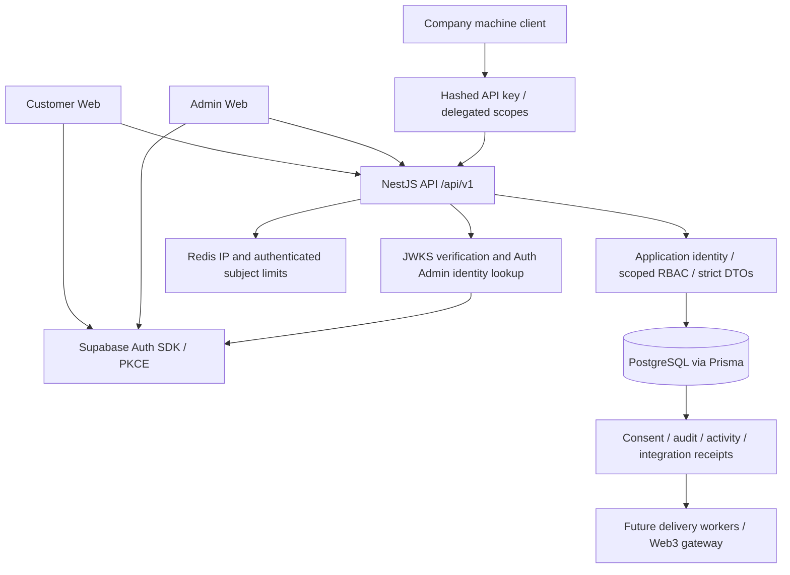

# System Architecture

RHC Digital is a monorepo with two Next.js applications and a NestJS API backed by Supabase PostgreSQL through Prisma. The following describes implemented boundaries, not a deployed/live-verified environment.

## Current behavior

- Password/signup/recovery calls go directly to Supabase, not obsolete API password endpoints. The API validates real JWTs and fetches authoritative Auth confirmation before linking/synchronizing an application user. No UUID bearer-token or mock database fallback exists.
- Browser confirmation/recovery requires same-browser PKCE code exchange. Email confirmation (`auth_email_confirmed_at`) is independent of business `PENDING`/reviewed `VERIFIED`; approval and ID issuance are separate backend operations. Approved/issued identity fields are self-service locked except mobile contact updates.
- Customer ownership routes, scoped admin lists/CRUD and global management actions use actual database grants and validated resources/bodies. Admin reference lists are UX, not authority. Reviewed governance and sensitive mutations persist audit/event evidence.
- Company keys are hashed, scoped and separately authenticated. Internal identity verification is consent-bound; allowlisted service events use idempotency receipts and do not perform business/ledger transitions.
- Global pre-auth IP limits and verified user/client Redis limits are wired. Real ingress attribution still depends on a manually approved `TRUSTED_PROXY_CIDRS` topology.
- `GET /auth/config` and the registration feature flag gate UX/new application provisioning, not raw provider signup. Supabase signup disablement/hooks and provider limits remain external configuration.

## Prepared, not operationally proven

Application data belongs behind the API, not direct browser PostgREST queries. All four migrations are pending, including application-table lockdown in `public` with RLS/revocations and **no FORCE RLS**. Owner/service backend access is intended; actual roles, grants and indirect access paths are unverified. No deployment or live acceptance is claimed.

R2, Resend, Twilio and Sentry configuration/extension points are not implemented-service or delivery guarantees. Rewards, Wallet, Marketplace and blockchain remain inactive/future scope. The diagram's future worker/gateway edge does not imply an existing durable delivery queue.

Priority order remains security, identity, companies, projects, properties, customer relationships, services, integration foundation, rewards foundation, audit, and future Web3. Blockchain is not a primary database: sensitive customer, property, financial, contract, authentication and business data remains off-chain.

See [current report](../month-1/targeted-completion-report.md), [database boundary](../database/schema.md), and [Month 2 handoff](../month-1/month-2-handoff.md).
