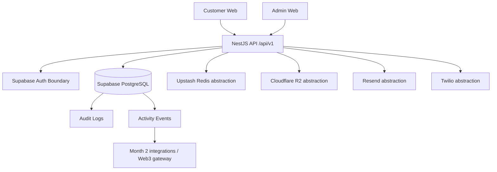

# System Architecture

RHC Digital is a monorepo composed of two Next.js applications and a NestJS API backed by Supabase PostgreSQL through Prisma.

Priority order: security, identity, companies, projects, properties, customer relationships, services, integration foundation, rewards foundation, audit, and future Web3.

Blockchain is not a primary database. Sensitive customer, property, financial, contract, authentication, and business data remains off-chain.
