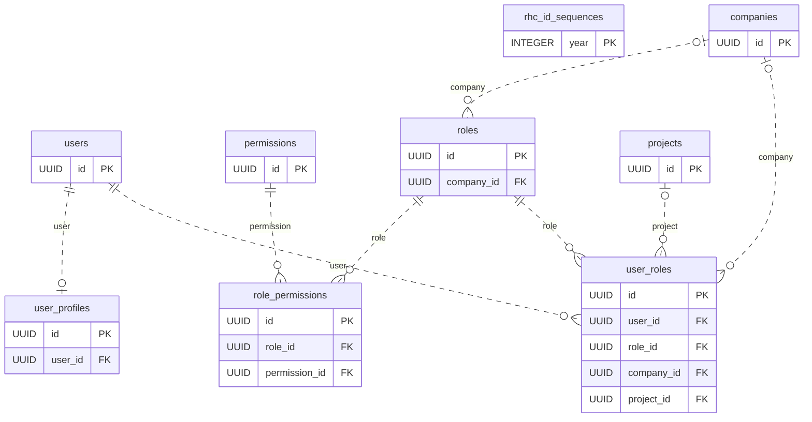
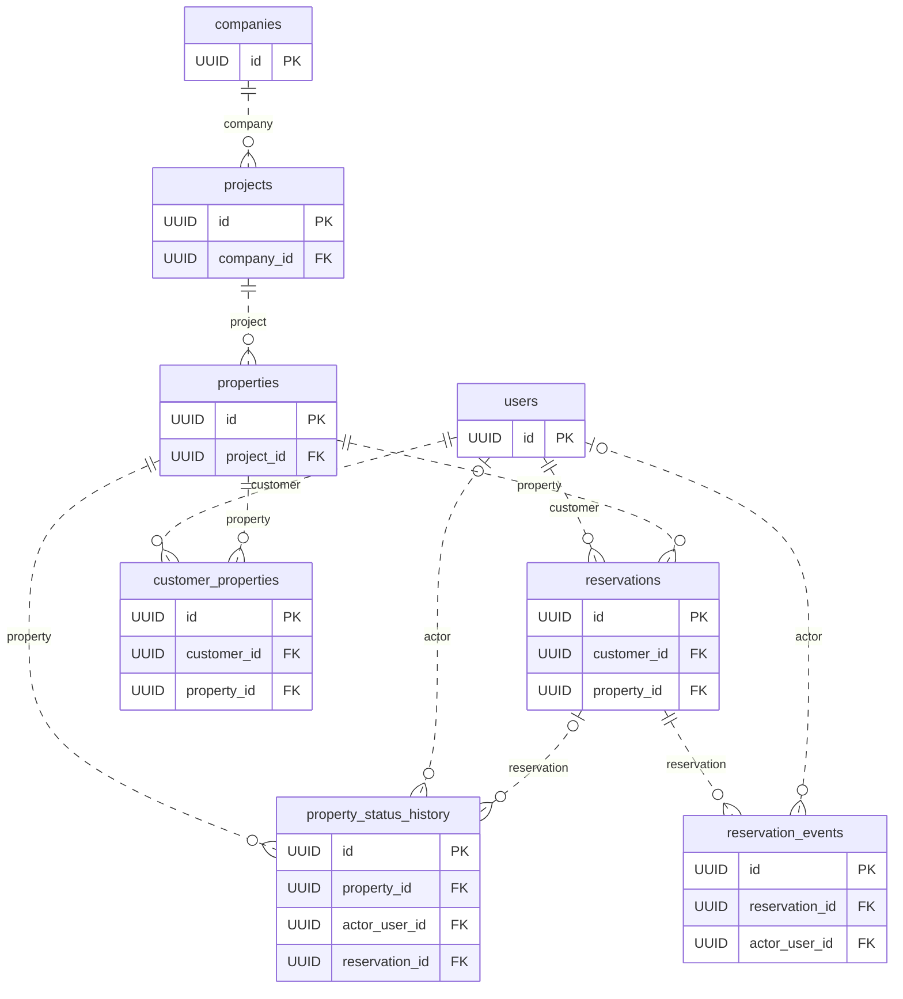
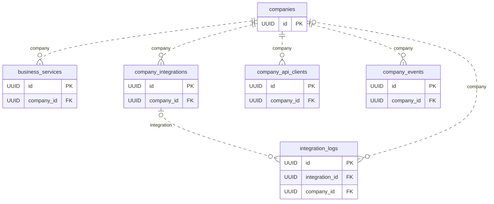
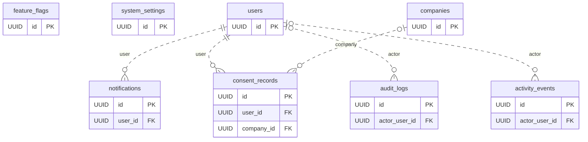
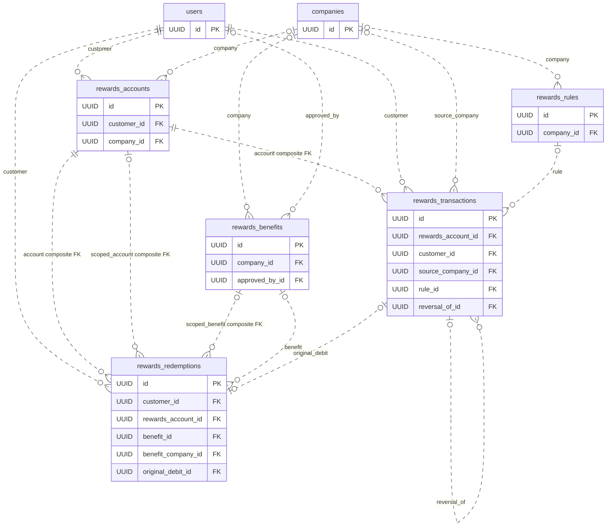
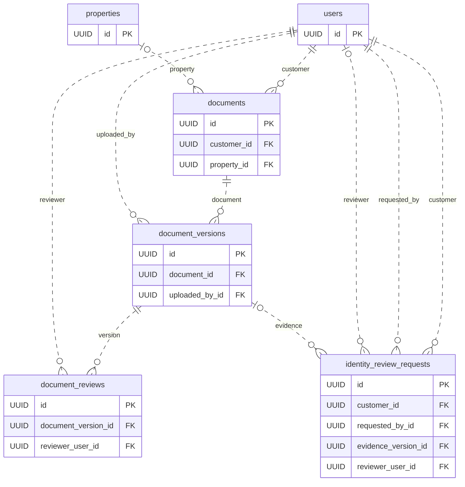
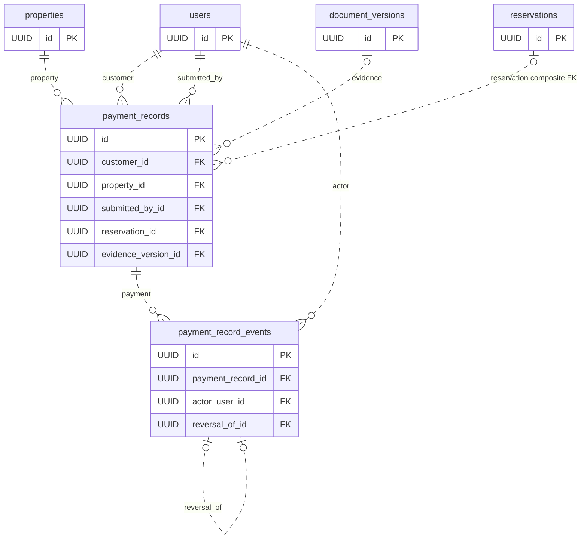
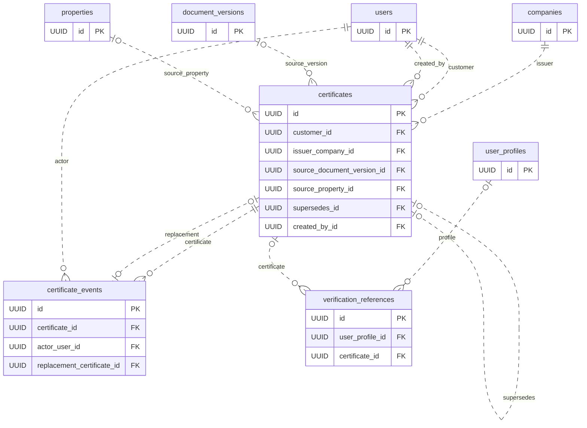
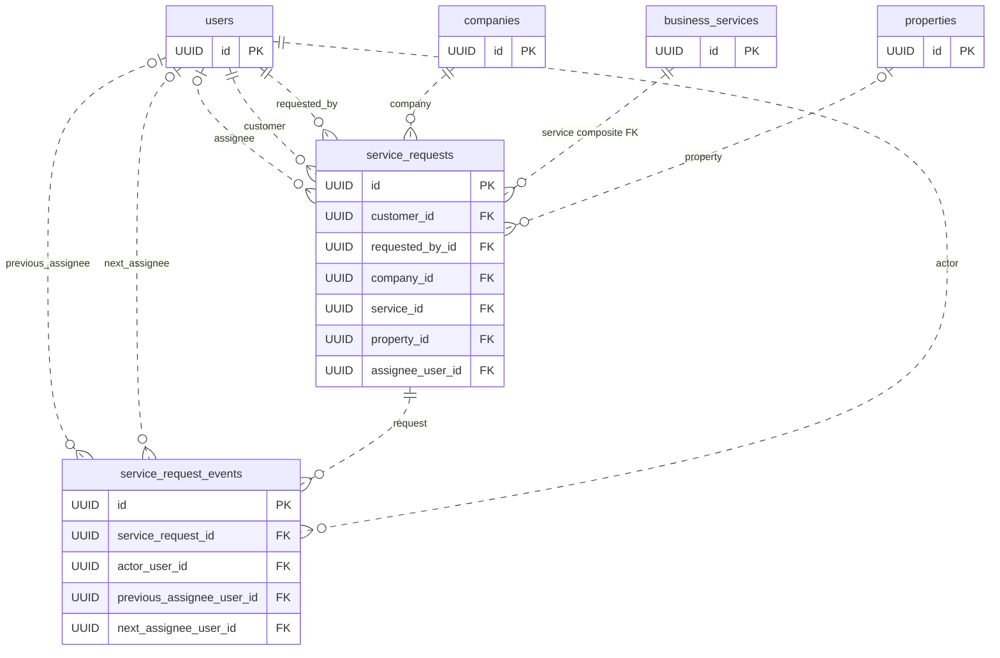
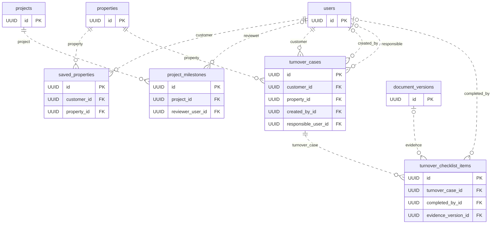

# Connected-domain ERD

**Source snapshot: 2026-10-06 — 45 application models: 29 existing + 16 new.**

These editable Mermaid diagrams, the [source map](connected-domain-source-map.md) and [data dictionary](connected-domain-data-dictionary.md) are the authoritative connected-domain design/source documentation until the next reviewed design update. [Prisma schema](../../packages/database/prisma/schema.prisma) and [connected-domain SQL](../../packages/database/prisma/migrations/202610060001_connected_domains/migration.sql) control exact definitions. The diagrams describe **source**, not deployed tables, activated APIs or approved business lifecycles. Provider Auth/storage, Prisma bookkeeping and optional operational proposals are excluded.

## Reading the diagrams

- Physical `@@map` table names are used. Diagrams split by child/owning-side domain; shared parent entities repeat for context and are **not additional tables**. Each model has one home diagram; each declared owning-side FK is drawn once in its child's home diagram.
- `||` at parent means exactly one parent is required; `o|` means zero or one. At child, `o{` means zero or more, and `o|` means zero or one where the FK columns themselves are unique. All parent collections may be empty. Dashed connectors are non-identifying FKs because child identities do not incorporate parent keys.
- Entity blocks show primary keys and FK scalar columns, not every attribute. Full types/nullability/defaults/checks/indexes and every scalar column are in the dictionary. A `FK` label identifies declared relation participation, not authorization or a polymorphic reference. Composite FKs are explained below and preserved in dictionary relation declarations.
- RHC ID counters, feature flags and settings are intentionally unconnected. `audit_logs`/`activity_events` company/project/entity IDs are contextual scalars, **not declared company/project/entity FKs**; no invented edges are drawn. External Auth linkage is not an application-table FK.
- Unique nullable FK cardinality applies only when non-NULL. Exact-one-source/target checks across multiple nullable FKs cannot be expressed by a single Mermaid edge; read the XOR notes below.
- All new FK delete/update actions are RESTRICT. Historical FK actions vary (including CASCADE/SET NULL); consult the dictionary/schema before deleting anything. Retention triggers impose stronger restrictions than diagram cardinality.

## Cross-domain invariants not expressible as edges

1. **Documents:** logical document → immutable versions → immutable version-specific reviews. Customer/property context is frozen. Identity/payment/checklist/certificate evidence points to an exact version, never “latest.” Customer consistency and applicable property/time checks are SQL guards, not extra FK edges. Storage paths are private identifiers; storage objects are outside this 45-table ERD.
2. **Identity:** PENDING-only request insertion, typed correction proposals, separate reviewer, immutable submissions/terminal decisions. A request decision has **no automatic write-through edge** to approved `user_profiles`. One optional evidence version is provisional; multi-evidence and field clearing need design approval.
3. **Payments:** `(reservation_id, customer_id, property_id)` references `reservations(id, customer_id, property_id)` when reservation is present. Reversal targets one VERIFIED event of the same payment. Partial unique indexes permit one review and one submission event. Payment headers are immutable; status is event-derived, not a stored mutable column or settlement guarantee.
4. **Certificates:** exactly one source: document version **XOR** property. Required issuer-company FK exists and remains distinct from creator and property developer. Same customer/type/issuer and **same property or same logical document** supersession is enforced; different versions of that document are allowed, cross-source/source-kind replacement is blocked pending approval. An event naming replacement must match its `supersedes_id`; replacement must already be issued and valid. One issuance and one terminal event are permitted. Certificate status derives from events and expiry, not a status column. **All certificate-event inserts require SERIALIZABLE** (SQLSTATE 25000 otherwise), with caller retries for 40001 serialization failures.
5. **Verification:** issued profile **XOR** certificate target. SQL hard-disables references (`enabled=false`, `disclosure_scope=NONE`). A target edge is not publication authorization; certificate-target references do not by themselves prove issuance. Raw tokens/public URLs are absent.
6. **Service requests:** `(service_id, company_id)` references `business_services(id, company_id)`. Provider company need not equal property's developer. Actual nullable current assignee and previous/next assignment user FKs exist; ordered immutable events retain assignment/unassignment. SQL identity links are not staff authorization. API must atomically synchronize mutable header status/assignee and history.
7. **Rewards:** existing account/customer composite FKs protect transaction/redemption subject. Redemption has a DB-derived nullable `benefit_company_id` snapshot: `(rewards_account_id, benefit_company_id)` → accounts `(id, company_id)` and `(benefit_id, benefit_company_id)` → benefits `(id, company_id)`. New candidate keys on both parents support these RESTRICT FKs, protecting non-NULL scoped links against later parent company changes, including NULLing; global benefits/unlinked legacy accounts do not acquire that blocker. The single benefit FK remains alongside scoped_benefit. Redemption has a unique optional original REDEEM debit; ledger reversals use the existing transaction self-link. Hard-inactive benefit catalog does not constitute an approved redemption/posting engine. Company/account eligibility and immutable accepted snapshots need the SQL/service rules in the dictionary.
8. **Journey:** saved-property uniqueness conveys no ownership. Milestone progress and reviewed publication are separate; ID/project/code/creation are frozen, not all published content. Turnover DRAFT is a **default, not a hard lock**; multiple cases per customer/property are allowed. Optional `created_by_id` and `responsible_user_id` are separate User FKs with nonunique indexes and inverse relations (`created_turnover_cases`, `responsible_turnover_cases`). Creator is immutable from insertion, including NULL; responsibility is mutable subject to future API authorization. Both fields are optional proposals: no actor or assignment is inferred, and existence of a User FK grants no authority. Optional checklist evidence is attach-once and completion freezes the item. Case completion is not automatically tied to checklist completion.
9. **Authorization:** new enum values, explicitly including service progress/assignment, milestone publication and turnover, remain proposals pending business approval. Strict RLS/table ACL lockdown covers only the **16 NEW tables**; existing notifications/redemptions grants and RLS configuration are preserved. The function ACL allowlist covers **14** new trigger functions. New-table RLS supplies no approved runtime grant; owner bypass is not authorization. Preflight now inventories all **45 tables**, but actual effective privileges, including existing grants covering added columns, still require target assessment. See the [source-map gap register](connected-domain-source-map.md#open-designsource-gaps--explicit-handoff).
10. **Clocks:** 23 timestamp defaults on new tables are explicit UTC transaction-time `dbgenerated` values. Seven new mutable-table updated_at fields are normalized by an alphabetically early DB trigger to UTC wall time before guards. Supplied factual timestamps remain validated, not overwritten. New/changed non-NULL notification read_at is separately DB-stamped UTC; NULL/unchanged values and existing timestamp defaults/rows remain untouched.

## Editable source diagrams

The diagram inventory is generated from local Prisma declarations, without a client or database. This is documentation extraction, not migration execution or runtime validation. Entity field type aliases use `enum` for enum attributes and Mermaid-safe names; exact native SQL types are in the dictionary.

### 1. Accounts and access control

Home models: `User`, `RhcIdSequence`, `UserProfile`, `Permission`, `Role`, `RolePermission`, `UserRole`. Other entities repeat only as FK context.

### 2. Companies, properties and reservations

Home models: `Company`, `Project`, `Property`, `PropertyStatusHistory`, `Reservation`, `ReservationEvent`, `CustomerProperty`. Other entities repeat only as FK context.

### 3. Service catalog and integrations

Home models: `BusinessService`, `CompanyIntegration`, `CompanyApiClient`, `CompanyEvent`, `IntegrationLog`. Other entities repeat only as FK context.

### 4. Governance, notifications and activity

Home models: `Notification`, `ConsentRecord`, `FeatureFlag`, `AuditLog`, `ActivityEvent`, `SystemSetting`. Other entities repeat only as FK context.

### 5. Rewards and benefit linkage

Home models: `RewardsAccount`, `RewardsRule`, `RewardsTransaction`, `RewardsRedemption`, `RewardsBenefit`. Other entities repeat only as FK context.

### 6. Documents and identity requests

Home models: `Document`, `DocumentVersion`, `DocumentReview`, `IdentityReviewRequest`. Other entities repeat only as FK context.

### 7. Payment evidence and events

Home models: `PaymentRecord`, `PaymentRecordEvent`. Other entities repeat only as FK context.

### 8. Certificates and disabled verification

Home models: `Certificate`, `CertificateEvent`, `VerificationReference`. Other entities repeat only as FK context.

### 9. Service requests and assignments

Home models: `ServiceRequest`, `ServiceRequestEvent`. Other entities repeat only as FK context.

### 10. Saved properties, milestones and turnover

Home models: `SavedProperty`, `ProjectMilestone`, `TurnoverCase`, `TurnoverChecklistItem`. Other entities repeat only as FK context.

## Coverage index

| # | Model | Physical table | Home diagram |
| ---: | --- | --- | --- |
| 1 | `User` | `users` | 1. Accounts and access control |
| 2 | `RhcIdSequence` | `rhc_id_sequences` | 1. Accounts and access control |
| 3 | `UserProfile` | `user_profiles` | 1. Accounts and access control |
| 4 | `Company` | `companies` | 2. Companies, properties and reservations |
| 5 | `Project` | `projects` | 2. Companies, properties and reservations |
| 6 | `Permission` | `permissions` | 1. Accounts and access control |
| 7 | `Role` | `roles` | 1. Accounts and access control |
| 8 | `RolePermission` | `role_permissions` | 1. Accounts and access control |
| 9 | `UserRole` | `user_roles` | 1. Accounts and access control |
| 10 | `Property` | `properties` | 2. Companies, properties and reservations |
| 11 | `PropertyStatusHistory` | `property_status_history` | 2. Companies, properties and reservations |
| 12 | `Reservation` | `reservations` | 2. Companies, properties and reservations |
| 13 | `ReservationEvent` | `reservation_events` | 2. Companies, properties and reservations |
| 14 | `CustomerProperty` | `customer_properties` | 2. Companies, properties and reservations |
| 15 | `BusinessService` | `business_services` | 3. Service catalog and integrations |
| 16 | `CompanyIntegration` | `company_integrations` | 3. Service catalog and integrations |
| 17 | `CompanyApiClient` | `company_api_clients` | 3. Service catalog and integrations |
| 18 | `CompanyEvent` | `company_events` | 3. Service catalog and integrations |
| 19 | `IntegrationLog` | `integration_logs` | 3. Service catalog and integrations |
| 20 | `Notification` | `notifications` | 4. Governance, notifications and activity |
| 21 | `ConsentRecord` | `consent_records` | 4. Governance, notifications and activity |
| 22 | `FeatureFlag` | `feature_flags` | 4. Governance, notifications and activity |
| 23 | `AuditLog` | `audit_logs` | 4. Governance, notifications and activity |
| 24 | `ActivityEvent` | `activity_events` | 4. Governance, notifications and activity |
| 25 | `RewardsAccount` | `rewards_accounts` | 5. Rewards and benefit linkage |
| 26 | `RewardsRule` | `rewards_rules` | 5. Rewards and benefit linkage |
| 27 | `RewardsTransaction` | `rewards_transactions` | 5. Rewards and benefit linkage |
| 28 | `RewardsRedemption` | `rewards_redemptions` | 5. Rewards and benefit linkage |
| 29 | `SystemSetting` | `system_settings` | 4. Governance, notifications and activity |
| 30 | `Document` | `documents` | 6. Documents and identity requests |
| 31 | `DocumentVersion` | `document_versions` | 6. Documents and identity requests |
| 32 | `DocumentReview` | `document_reviews` | 6. Documents and identity requests |
| 33 | `IdentityReviewRequest` | `identity_review_requests` | 6. Documents and identity requests |
| 34 | `PaymentRecord` | `payment_records` | 7. Payment evidence and events |
| 35 | `PaymentRecordEvent` | `payment_record_events` | 7. Payment evidence and events |
| 36 | `Certificate` | `certificates` | 8. Certificates and disabled verification |
| 37 | `CertificateEvent` | `certificate_events` | 8. Certificates and disabled verification |
| 38 | `VerificationReference` | `verification_references` | 8. Certificates and disabled verification |
| 39 | `ServiceRequest` | `service_requests` | 9. Service requests and assignments |
| 40 | `ServiceRequestEvent` | `service_request_events` | 9. Service requests and assignments |
| 41 | `SavedProperty` | `saved_properties` | 10. Saved properties, milestones and turnover |
| 42 | `ProjectMilestone` | `project_milestones` | 10. Saved properties, milestones and turnover |
| 43 | `TurnoverCase` | `turnover_cases` | 10. Saved properties, milestones and turnover |
| 44 | `TurnoverChecklistItem` | `turnover_checklist_items` | 10. Saved properties, milestones and turnover |
| 45 | `RewardsBenefit` | `rewards_benefits` | 5. Rewards and benefit linkage |

Total: **45 unique models**, **29 existing + 16 new**, with 96 owning-side FK relations drawn. The dictionary inventories 472 scalar/enum columns, including 186 on the new tables. Repeated context entities are not counted twice. SQL-only checks/partial indexes/triggers are in the dictionary, not invented diagram relationships.
