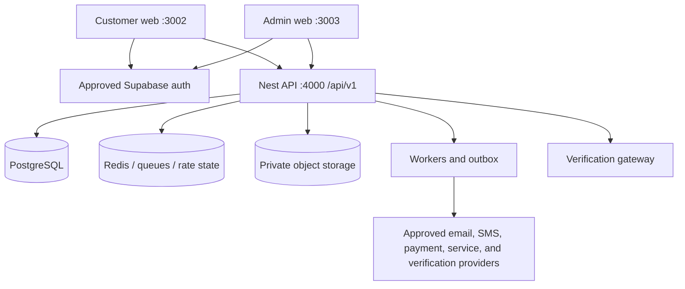

# Phase 2 Handoff: Real Services and Acceptance

**Handoff status:** The RHC Digital Month 1 Local MVP and adapter split are implemented and ready for internal UAT/acceptance. The next phase is real-service integration and acceptance—not more fixture polish.  
**Release status:** **Not production-ready and not authorized for deployment.**

## Current baseline

| Area               | Implemented now                                                                                                                                | What is not established                                                            |
| ------------------ | ---------------------------------------------------------------------------------------------------------------------------------------------- | ---------------------------------------------------------------------------------- |
| Web surfaces       | 40 customer and 31 admin routes on ports `3002` and `3003`.                                                                                    | Full cross-browser, accessibility, UAT, and production acceptance.                 |
| Local demo         | Explicit `npm run dev:demo`, customer-hosted `/api/demo/**`, named personas, and shared `.rhc-demo/world.json`.                                | Production auth, authorization, transactions, storage, jobs, or provider behavior. |
| Connected adapters | Frontends can select Supabase auth and a configured Nest `/api/v1` API; real API default is port `4000`.                                       | A provisioned and accepted Supabase/PostgreSQL/Redis/provider environment.         |
| Workflow UX        | Profile, reservations, identity, document versions, payment evidence, rewards, certificates, services, reports, and recovery are demonstrable. | Equivalent durable live domains for every demo endpoint and transition.            |
| Governance         | Future wallet/token/blockchain features remain visibly inactive.                                                                               | Legal, compliance, security, product, content, and release approvals.              |

**Adapter readiness is not live activation.** A page calling an API-shaped path, a Nest controller existing in source, or a successful fixture mutation does not prove a deployed service, real authorization, database durability, or provider integration.

## Target connected architecture

Every edge needs configuration, least-privilege credentials, failure handling, observability, tests, and an approval owner. The local demo hub is not part of this production path.

## Workstream 1 — real authentication and sessions

1. Provision approved nonproduction Supabase projects before any production target.
2. Validate signup policy, PKCE confirmation/recovery, refresh, logout, expiry, revocation, and disabled/locked account behavior against real provider sessions.
3. Require appropriate administrator MFA/step-up policy and document recovery ownership.
4. Confirm issuer, audience, JWKS rotation/cache behavior, email-confirmation synchronization, and fail-closed handling.
5. Prove demo tokens, persona IDs, browser fixture cookies, and `.rhc-demo` data are rejected by connected mode and the Nest API.
6. Complete privacy, retention, account-linking, and support procedures for real identities.

## Workstream 2 — API contracts and authorization

- Map every customer/admin page to an owned `/api/v1` contract, including intentional unavailable states.
- Replace demo-only aggregate and workflow paths with reviewed live-domain endpoints; do not expose `/api/demo` shapes as a production shortcut.
- Keep authorization authoritative in Nest using role, permission, company, project, record ownership, and lifecycle state.
- Validate maker-checker rules, self-approval denial, auditor read-only behavior, cross-company isolation, stale-state conflicts, and field-level response filtering.
- Add contract tests between both frontend adapters and the deployed API.
- Treat the demo persona matrix as UX input only; it is not evidence that production RBAC is correct.

The payments, documents, certificates, service-request, rewards-ledger, and report workspaces are especially important contract gaps: their fixture workflows and report/export semantics must be designed, implemented, and accepted as real domains before they can be called live.

## Workstream 3 — PostgreSQL transactions and concurrency

Real persistence must move business invariants into database-backed transactions and constraints.

| Domain           | Required real behavior                                                                                                                    |
| ---------------- | ----------------------------------------------------------------------------------------------------------------------------------------- |
| Profile/consent  | Field policy, versioned consent, immutable history, privacy retention, and audited actor/context.                                         |
| Reservations     | Transactional availability check, unique active hold, expiry, cancellation/release, idempotency, and concurrent-client tests.             |
| Identity         | Separate email confirmation, business review, approval actor, issuance eligibility, and immutable identifiers.                            |
| Documents        | Version lineage, metadata/hash transaction, review state, and storage-object consistency.                                                 |
| Payment evidence | Evidence intake and reviewed accounting record without falsely becoming a payment processor; append-only corrections.                     |
| Rewards          | Append-only ledger, qualifying rule/version, unique idempotency key, balance derivation, reversal/expiry policy, and settlement boundary. |
| Certificates     | Source-version link, issuance, expiry, supersession/revocation, and public minimal projection.                                            |
| Service requests | Company scope, transition rules, assignment, provider dispatch state, and event history.                                                  |

Run migrations and tests only against approved nonproduction targets first. The JSON store's single-process queue, atomic temporary-file publication, fail-closed corruption handling, and revision check are not proof of PostgreSQL locking, isolation, or multi-worker safety.

## Workstream 4 — private storage and document handling

- Use private object storage with server-side authorization and short-lived signed access.
- Define upload limits, MIME/content verification, malware scanning, encryption, retention, legal hold, deletion, and incident handling.
- Store hashes and metadata transactionally with object references; define cleanup for partial database/storage failure.
- Preserve document versions and source lineage. Never treat a browser filename or client hash as authoritative.
- Prevent customer documents, payment evidence, and confidential governance files from entering public asset trees.

The current demo accepts bounded synthetic text only. It proves no real upload or storage behavior.

## Workstream 5 — jobs, providers, and operational recovery

- Implement a transactional outbox and idempotent workers for notifications, expiry, verification publication, provider dispatch, and reconciliation.
- Define retry, backoff, dead-letter, replay, duplicate, ordering, timeout, and manual-recovery behavior.
- Integrate email/SMS only after template, consent, suppression, delivery, and privacy approval.
- Treat payment evidence separately from payment initiation, capture, refund, and settlement. Any payment gateway requires finance, legal, PCI, security, and reconciliation approval.
- Treat business-service connectors as provider-specific integrations with scoped credentials; metadata marked `PREPARED` is not a live connector.
- Add health, queue-depth, lag, failure, and reconciliation monitoring with owned alerts/runbooks.

## Workstream 6 — verification gateway

1. Define canonical record serialization and versioned hashing.
2. Sign or publish only the approved minimum verification projection.
3. Implement expiry, revocation, supersession, key rotation, replay protection, and audit evidence.
4. Threat-model QR/reference enumeration and keep customer discovery impossible.
5. Add blockchain anchoring only after network, contract, key custody, cost, privacy, legal, compliance, and security approval.
6. Keep `RHC Verified` distinct from government verification, legal title, and blockchain proof.

A fixture `VALID` result and `blockchain_status: NOT_REQUESTED` are adapter examples, not a live verification gateway. Malformed local fixture stores are preserved and require an explicit confirmed reset; this recovery behavior is not a substitute for production backup/restore.

## Workstream 7 — security and reliability review

Required before release consideration:

- threat models for auth, admin, public verification, documents, payments, rewards, integrations, and jobs;
- production CORS/CSRF/session policy, trusted-proxy configuration, headers, rate limits, abuse controls, and secrets management;
- RBAC/tenant-scope test matrix plus independent authorization review;
- dependency, SAST, DAST, penetration, privacy, and logging/redaction review;
- backup/restore, disaster recovery, rollback, migration rehearsal, load, concurrency, and failure-injection evidence;
- observability with correlation IDs, immutable audit expectations, alerts, and incident runbooks.

No production authorization acceptance exists yet. Local persona denial and fixture audit rows are not substitutes.

## Approval gates

| Gate                     | Required decision                                                                                       |
| ------------------------ | ------------------------------------------------------------------------------------------------------- |
| Product/process owner    | Approve lifecycle states, roles, exception handling, and UAT outcomes.                                  |
| Finance                  | Approve payment-record meaning, reconciliation, rewards rules, reversals, and any gateway scope.        |
| Privacy/legal/compliance | Approve identity data, consent, retention, public verification, rewards language, and provider sharing. |
| Security                 | Approve architecture, auth, authorization, storage, jobs, gateway, testing, and residual risk.          |
| Content owner/legal      | Approve or remove the rendered `/white-paper` summary for the intended audience.                        |
| Release owner            | Approve environment evidence, rollback, operations, and deployment window.                              |

The confidential source remains `documents/RHC WEB3 WHITEPAPER v1.0.pdf`; the former public PDF duplicate is removed. Route protection alone is not content approval.

## Definition of done for the next phase

The phase is complete only when a named approved nonproduction environment provides evidence that:

- real Supabase identities and Nest authorization pass positive and negative scenarios;
- migrations apply cleanly and rollback/recovery procedures are rehearsed;
- PostgreSQL transaction, idempotency, and concurrent-client invariants hold;
- private storage and document controls pass security/privacy review;
- jobs and providers demonstrate retries, deduplication, reconciliation, and observability;
- public verification and credential lifecycle pass privacy and security acceptance;
- all 40 customer and 31 admin routes have an intentional connected-mode outcome;
- lint, typecheck, tests, builds, browser suites, audits, network tests, and UAT are rerun against the final revision;
- every approval gate is recorded.

Until then, RHC Digital remains a strong local MVP/product prototype and adapter-ready codebase—not a live production system.

## Explicitly out of scope without separate approval

- Production deployment, migration, seeding, or identity bootstrap.
- Public token issuance, token sale, transfer, staking, exchange, custody, crypto payments, or tokenized ownership/title.
- Treating local demo persistence, permissions, records, or verification as legal, financial, security, or infrastructure acceptance.
