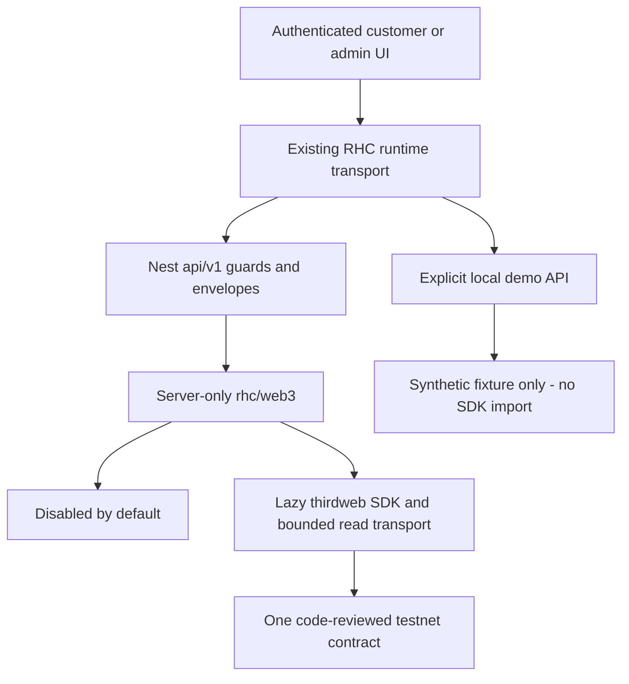

# Thirdweb read-only implementation

Status: **read-only connector implemented and offline-tested; live testnet acceptance pending**. The authorized installation retry, full SDK build and CommonJS offline tests passed. See [readiness](integration-readiness.md) and [test results](thirdweb-readonly-test-plan.md).

## Data paths

### Actual routes

| Path | Behavior/access |
| --- | --- |
| `GET /api/v1/web3/token` | Existing connected `AuthGuard`, verified bearer identity/application account, existing authenticated rate checks; returns disabled state after auth if off |
| `GET /api/v1/admin/integrations/thirdweb` | Same auth plus `PermissionGuard`, exact `integration.view` with `target: global`; no company/project grant elevation |
| `GET /api/v1/auth/config` | Existing public config route adds only `web3_read_preview_enabled`; no token metadata, addresses, secrets or provider health; no new public route |
| `GET /api/demo/web3/token` | Existing local demo session; customer persona only |
| `GET /api/demo/admin/integrations/thirdweb` | Existing local staff session, `integration.view`, global persona |

Nest responses retain `{ success, data, meta: { request_id } }`, normal safe error envelopes, `Cache-Control: no-store`, existing Redis/IP/authenticated-user rate limiting, and endpoint limit 60 under the existing rate policy. No new write endpoint exists. Demo non-GET attempts return read-only denial. Demo tokens are rejected by the real Nest JWT verifier.

Customer UI additionally requires an active non-admin account before mounting the reader. Nest preserves existing self-service account rules (`ACTIVE`/`PENDING`, not `DISABLED`/`LOCKED`), rather than inventing a customer-role grant. Admin UI fails closed when flattened session scopes cannot demonstrate global access; mixed global/scoped assignments may be conservatively hidden. Server permissions remain authoritative.

Read endpoints do not mutate business records or persist diagnostics. Existing audit/management flows remain intact; no invented audit event or secret-bearing integration/settings record is added.

## Files and responsibilities

- `packages/types/src/web3.ts`: browser-safe DTO and field discriminants; exported by `src/index.ts` (also adds read-preview flag type).
- `packages/web3/src/config.ts`: safe env validation and empty approved-contract allowlist.
- `read-provider.ts`, `disabled-read-provider.ts`, `fixture-read-provider.ts`: two-method read interface and offline modes.
- `thirdweb-read-provider.ts`: single-flight read, cache, freshness, retry/backoff, timeout, invalidation.
- `sdk-snapshot.ts`: lazy thirdweb client/contract, chain/code checks, ABI reads at explicit block height, end-block hash check.
- `transport.ts`: private four-method HTTP JSON-RPC transport with body-inclusive abort and response-size limit.
- `snapshot.ts`, `errors.ts`: precise formatting, metadata limits, safe diagnostic vocabulary.
- `src/index.ts`: Node-only package entry, configuration fingerprint and provider selection; never browser-exported.
- `packages/web3/package.json`, `tsconfig*.json`, `.env.example`, `scripts/testnet-read.cjs`, `test/*.test.cjs`: dependency/config, offline and operator checks.
- `apps/api/src/modules/web3/*`: lazy service, controllers, module; `app.module.ts` registers controllers alongside existing guards and imports the service module.
- `apps/api/src/modules/security/feature.guard.ts`: deployment-only read-preview flag mapping; `modules/auth/auth.controller.ts`: config indicator.
- `apps/api/package.json`: server dependency; root `package.json`: API/all/typecheck build order; `package-lock.json`: normal SDK/workspace resolution.
- `apps/customer-web/app/components/web3-preview.tsx`: verified customer-only mounting within `components/meridian-public/future-technology.tsx`.
- `apps/customer-web/app/lib/demo/web3-fixture.ts`, `router.ts`: standalone local fixture and existing authorization seam; no connector/SDK import.
- `apps/admin-web/app/integrations/thirdweb-read-panel.tsx`, `page.tsx`: diagnostics within current workspace; `admin-data.tsx` accepts optional module children.
- `packages/ui/src/web3-read-panel.tsx`, `index.tsx`: shared textual display; `runtime.tsx` exposes session-presence boolean without exposing tokens.
- Tests: `apps/api/test/web3-{boundary,feature}.spec.ts`, updated `consent.e2e-spec.ts`, `scripts/demo-store-test.mjs`, `scripts/web3-browser-test.mjs`, `apps/customer-web/tests/web3-browser-harness.tsx`.
- Four Markdown handover documents and bounded test-output `.txt` evidence under `docs/web3/`.

No Prisma schema/migrations/seeds/grants, points ledger, financial rules, verification routing, or actual secret-bearing environment file was modified.

## Configuration mapping

Template: `packages/web3/.env.example` (backend only). The proposed `RHC_WEB3_PREVIEW_ENABLED` name is mapped **once** to existing-style `ENABLE_WEB3_READ_PREVIEW`; do not set both.

| Name | Default / validation |
| --- | --- |
| `RHC_WEB3_PROVIDER` | `disabled`; only `disabled`, `fixture`, `thirdweb` |
| `ENABLE_WEB3_READ_PREVIEW` | false; only literal `true` enables; `FeatureService` uses this env rather than DB rows |
| `RHC_WEB3_ALLOW_NETWORK_READS` | false; separate explicit read authorization |
| `RHC_WEB3_NETWORK_MODE` | `testnet`; any other mode refused |
| `RHC_WEB3_CHAIN_ID` | absent; positive safe integer, exact code-reviewed allowlist match |
| `RHC_WEB3_TOKEN_CONTRACT_ADDRESS` | absent; nonzero EVM address, exact approved contract match (case-insensitive) |
| `THIRDWEB_SECRET_KEY` | absent; backend-only, nonempty bounded non-whitespace/non-JWT key; never `NEXT_PUBLIC_*` |
| `RHC_WEB3_READ_TIMEOUT_MS` | 5000; integer 100–10000; one total read/retry deadline |
| `RHC_WEB3_CACHE_TTL_SECONDS` | 30; integer 1–300 |
| `RHC_WEB3_MAX_STALE_SECONDS` | 120; integer 1–3600 and >= TTL; maximum total age since successful observation |
| `RHC_WEB3_ACCEPTANCE_AUTHORIZED` | false; additional CLI operator gate, not part of the application flag |

Timing defaults are engineering controls, not an SLA. Disabled/fixture modes need no credentials. Fixture mode is accepted only by explicit local demo/test context; connected Nest refuses it. Inherited `RHC_APP_PROFILE=demo`, `RHC_DEMO_MODE=1`, or `NEXT_PUBLIC_RHC_DATA_MODE=demo` blocks connected thirdweb egress, even under conflicting provider values. Actual demo code never imports the server package at all. NODE_ENV does not authorize provider reads.

Adding a network requires a reviewed source change with chain ID/name, **one exact contract**, HTTPS explorer origin, optional read-method allowlist and approval reference. No runtime RPC URL, arbitrary address lookup, fallback network or wallet parameter is accepted. The default list is empty. Mutable DB flags cannot activate excluded functions because these functions/routes do not exist.

## Truth model and reads

The DTO independently reports source (`disabled`, `synthetic`, `thirdweb_testnet`), connection (`disabled`, `not_configured`, `ready`, `degraded`, `unavailable`), snapshot (`absent`, `fresh`, `stale`, `partial`), configuration validity and safe diagnostic code. Capability is always `read_only`; contract restriction assessment is always `not_assessed`.

Token fields use `observed` with a value versus `unsupported`/`unavailable` with null. Optional cap/paused are unsupported unless explicitly reviewed in the approval record. Revert, empty return or failed decode is unavailable, never false/zero. No draft cap is inferred. Raw supply/cap are exact integer strings; formatted strings use bigint and observed decimals (0–255); missing decimals leave formatted value null. Decimals alone use Number as uint8 metadata. No token amount is converted to Number.

The SDK path uses `createThirdwebClient`, `defineChain`, `getContract`, `eth_call`, `eth_getBlockByNumber`, and `decodeAbiParameters`. It verifies observed `eth_chainId`, selects latest block, reads nonempty contract code and every token field at that explicit height, and checks the selected block hash again. Block number/timestamp are decimal strings; block timestamp is Unix seconds. Finality is **observed**, not confirmed/finalized. Height pinning plus end-hash validation detects an end-state reorg, but is not independent verification or a guarantee against inconsistent load-balanced RPC responses; hash-pinned/independent verification is a later acceptance decision.

`eth_getCode` is sent using the documented JSON-RPC method because this SDK wrapper only exposes block tags; genesis `eth_call` uses explicit raw height `0x0` to avoid the SDK's falsy `blockNumber: 0n` fallback. No metadata URI/image is fetched. Token strings are limited to 120 characters with control/bidi characters stripped, then rendered as React text.

## Timeout, cache and safe failures

- A lazily created provider owns one snapshot/cache and one inflight operation. No background polling; admin status never probes the provider.
- Cache fingerprint contains source, chain/contract, flags, timing and credential rotation (SHA-256, never exposed). Relevant config changes replace the provider, abort old work and discard old cache.
- All HTTP requests are sequential within one AbortController deadline, including streaming body consumption. Body limit: 256 KiB per response. Redirects forbidden; no credential forwarding to alternate hosts.
- Up to one transient network/5xx retry of the snapshot, within the same deadline. No automatic retry for auth, rate limit, chain mismatch, no bytecode or ordinary method failures. At most 10 requests per complete six-field attempt, 20 over two attempts.
- SDK 5.121.6's stock timeout ends at headers. An owned transport is therefore passed as the SDK's EIP-1193 read function; there is no Promise.race cancellation claim or production global-fetch monkey patch.
- Failures suppress rereads for at least TTL; HTTP `Retry-After`/rate-limit backoff may extend suppression. A very long upstream Retry-After can deliberately keep the provider unavailable until that time; operations should review anomalous backoff rather than overriding it with retry storms.
- Stale observations keep the original last-success time; age expiry removes data. Wrong-chain, no-contract, reorg and provider-auth failures discard cached metadata immediately.
- Configuration errors are safe feature states, not app-start failures. Native provider messages/URLs/stacks are not returned or logged by the connector. No account billing/usage endpoints are invented.
- Browser cancellation remains in existing `useResource`. A shared server snapshot may finish after a caller disconnects, bounded by its single deadline; one caller cannot cancel other subscribers' work.

## Official references checked

- https://portal.thirdweb.com/typescript/v5/client
- https://portal.thirdweb.com/typescript/v5/eth_call
- https://portal.thirdweb.com/typescript/v5/eth_getCode
- https://portal.thirdweb.com/typescript/v5/eth_getBlockByNumber
- https://registry.npmjs.org/thirdweb/5.121.6
- Version-pinned `https://unpkg.com/thirdweb@5.121.6/` client declarations, RPC actions, chain helpers and fetch implementation.

Published exports include CommonJS targets, consistent with Nest. **Local CommonJS SDK execution and the full TypeScript build passed after the authorized installation retry.** The connector suite passed 52 tests without skips using intercepted RPC responses. Nest typecheck/build and 252 unit tests also passed. This is offline interoperability evidence on Node 24.12.0, not live connectivity or Node 22 acceptance. No monorepo module-format conversion was made.
